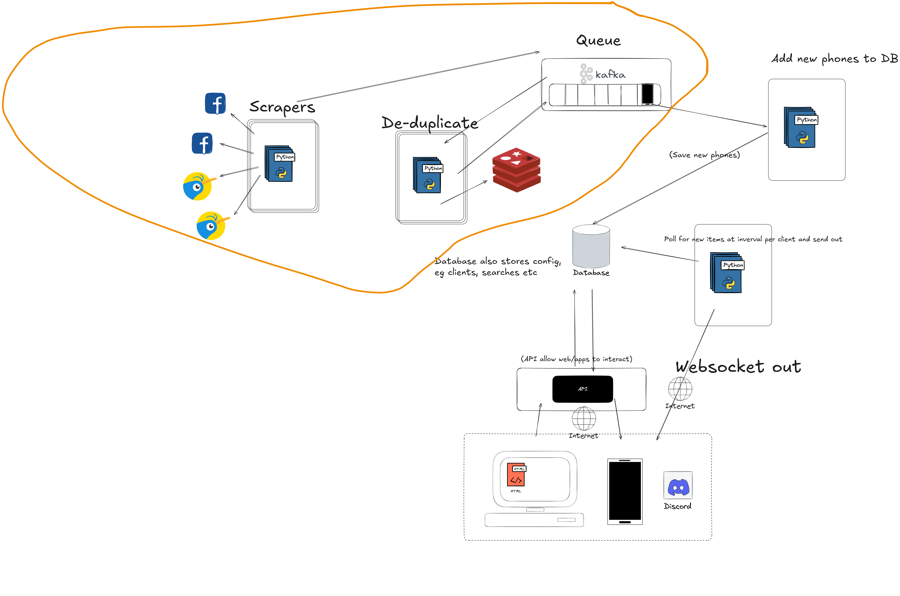

# Marketplace Scraper Playwright
## A scraper for Marketplace listing using Python, Playwright Asyncio (still a work in progress)



The `scraper` app continuously scraps the same job params, it is unaware if an item is new to it or not.
It produces all scrapes to topic `scraped_items`.
Observe with:
```shell
docker run --rm -it \
  --network docker_compose_scraper \
  bitnamilegacy/kafka:3.3.2 \
  kafka-console-consumer.sh \
    --bootstrap-server kafka:9092 \
    --topic scraped_items \
    --from-beginning
```

The `de_duplication` app ensures only new items are passed on. It consumes topic `scraped_items` (produced by the scaper) and checks against Redis if it has seen these items before.
If they are new it then produces these new items to topic `new_items`
Observe with:

```shell
docker run --rm -it \
  --network docker_compose_scraper \
  bitnamilegacy/kafka:3.3.2 \
  kafka-console-consumer.sh \
    --bootstrap-server kafka:9092 \
    --topic new_items \
    --from-beginning
```
### Build
```shell
source venv/bin/activate
pip install -r requirements.txt
```
### Config
- All development config is in `.env`. This is picked up by `config.py`
- Currently, it will only read scrape jobs from a file from `./job_params` with individual json entries like:
```shell
{"country": "New Zealand", "radius": "100", "radius_unit": "kilometres", "days_listed": 1, "exact": true, "top_results": 5, "not_include": "case", "city": "Whanganui", "product": "iPhone 11", "min_price": 30, "max_price": 395}
```
....this is extendable in `job_source.py`
### Running
```shell
python main.py
```
### Tracing
```shell
playwright show-trace trace.zip
```
### Docker Compose
There is a development Kafka and Redis set up in `/docker-compose`. In order to run the apps you need to bring this up with `docker compose up` in that directory
