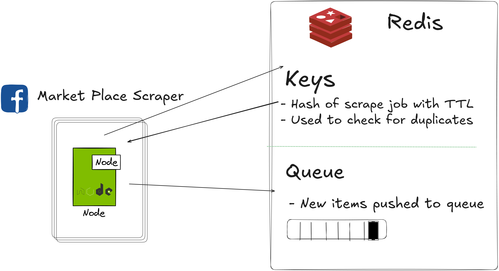

# Marketplace Scraper Playwright
## A scraper for Marketplace listing using NodeJS and Playwright



The `scraper-js` app continuously scraps the same job params and checks for duplicates against Redis keys. It then pushes new items to a Redis queue.

### Config
- See `scraper-js/config.js`
### Running
```shell
node index.js
```
### Tracing
```shell
playwright show-trace trace.zip
```
### Docker Compose
There is a development Kafka and Redis set up in `/docker-compose`. In order to run the apps you need to bring this up with `docker compose up` in that directory
